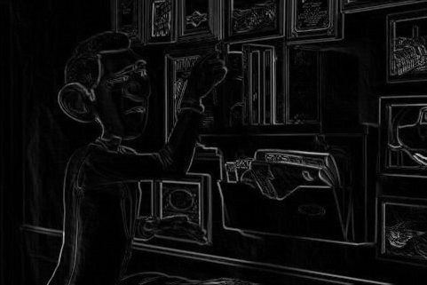
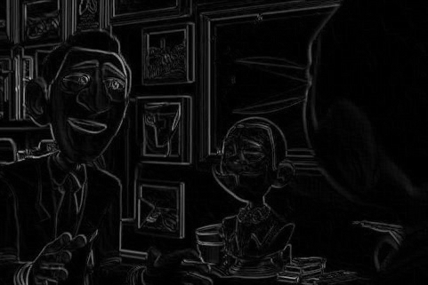

# EDEF
EDEF is evolutionary designer of edge filter. You can develop, test, use, damage and repair filters.

Only JPEG image format is supported.

## Ilustration
<table>
	<tr>
		<th>Original</th>
		<th>Sobel filter (reference)</th>
		<th>Evolutionary designed</th>
	</tr>
	<tr>
		<td></td>
		<td></td>
		<td></td>
	</tr>
	<tr>
		<td></td>
		<td></td>
		<td></td>
	</tr>
</table>

The used original image is from Agent 327: Operation Barbershop (2017) ([https://www.youtube.com/watch?v=mN0zPOpADL4](https://www.youtube.com/watch?v=mN0zPOpADL4)).
## Install
EDEF needs to be compiled. Use:

    make

## Train/develope filter
For developing new filter run:

    ./edef -train -set *.jpg -setOut *.jpg -config config.ini -out chromosome.bin

Develops filter (chromosome.bin) on given data set. There are used multiple images for training but one image is good enough.

## Use filter
If you want to use filter on an image run:

    ./edef -use -chromosome chromosome.bin -on img.jpg -out result.jpg

## HELP

There are few examples how to use this program, but if you want to know more use help.

    Thank you for using EDEF. This program was developed at FIT BUT as project to course: Bio-Inspired Computers.

	-train
		You want to develop new edge detection filter on given training data set.
		PROVIDE: -set, -setOut, -config, -out
	-repair
		It will try to find new implementation of filter with given resources (damaged before).
		PROVIDE: -set, -setOut, -chromosome, -config -out
	-damage
		Will damage the existing filter. Randomly selects block and changes it to block with 0 output.
		PROVIDE: -chromosome -out
	-test
		You want to test your developed filter on given testing data set.
		PROVIDE: -set, -setOut, -chromosome
	-status
		Checks filter state (how much it is damaged).
		PROVIDE: -chromosome
	-use
		Use filter on given image.
		PROVIDE: -chromosome -on -out
	-set
		Paths to images for train/test set (filled with jpg images).
	-setOut
		Paths to images for required filter output. Image must be on same position as coresponding image from -set.
	-on
		Path to image (jpg).
	-out
		Path to file for result.
	-chromosome
		Path to saved chromosome.
	-config
		Path to configuration file.
	-h
		Writes help to stdout and exists the program.
